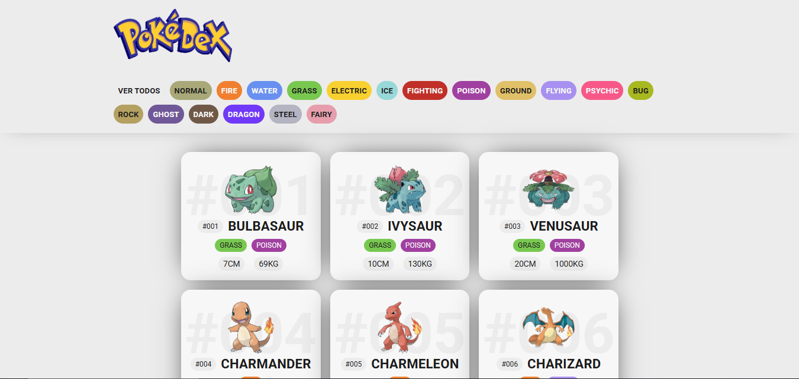

# Pokédex Web App

A **responsive and interactive Pokédex** built with **HTML, CSS, and Vanilla JavaScript**, consuming data from the **PokeAPI**. Explore the first **151 Pokémon (Generation I)** with official artwork, stats, and real-time type filters.



---

## Table of Contents

1. [Project Overview](#project-overview)
2. [Features](#features)
3. [Project Structure](#project-structure)
4. [How It Works](#how-it-works)
5. [Code Explanation](#code-explanation)
6. [Responsive Design](#responsive-design)
7. [Accessibility & UX](#accessibility--ux)
8. [Possible Improvements](#possible-improvements)
9. [API Reference](#api-reference)
10. [License](#license)

---

## Project Overview

This project dynamically fetches Pokémon data (IDs 1–151) from the **PokeAPI** and displays each Pokémon as a **card** containing:

* Official artwork
* Pokémon ID and name
* Types (with color-coded badges)
* Height and weight

Users can filter Pokémon by type using the **header buttons**, and a **Back to Top** button allows smooth navigation on long pages.

---

## Features

* Dynamic fetching of Pokémon data via **Fetch API**
* Render Pokémon cards using **DOM manipulation**
* Real-time **filtering by type**
* **Responsive layout** (1–3 columns depending on screen size)
* Smooth **Back to Top** button
* Pure **HTML, CSS, and JavaScript** — no frameworks

---

## Project Structure

```
POKEDEX/
├── index.html          # Main HTML file
├── css/
│   └── style.css       # Styles, including responsive grid and type colors
├── js/
│   ├── main.js         # Main app logic, fetch + render + filter
│   └── backToTop.js    # Smooth scroll back-to-top button
└── img/
    ├── logo.png
    ├── favicon.png
    └── finalProject.PNG # Project preview
```

---

## How It Works

1. On page load, the app fetches Pokémon data for **IDs 1–151**.
2. Each Pokémon is rendered dynamically as a **card** with stats and artwork.
3. Type buttons in the header filter Pokémon **without reloading**.
4. When scrolling down, a **Back to Top** button appears.

---

## Code Explanation

### Fetching and Rendering Pokémon

```javascript
const pokemon_list = document.querySelector("#pokemon_list");
let URL = "https://pokeapi.co/api/v2/pokemon/";

for (let i = 1; i <= 151; i++) {
    fetch(URL + i)
        .then(response => response.json())
        .then(data => showPokemon(data));
}

function showPokemon(poke) {
    let types_pokemon = poke.types.map(type => 
        `<p class="${type.type.name} type">${type.type.name}</p>`
    ).join('');

    let poke_id = poke.id.toString().padStart(3, '0');

    const div = document.createElement("div");
    div.classList.add("pokemon");
    div.innerHTML = `
        <p class="pokemon__id__back">#${poke_id}</p>
        <div class="pokemon-imagen">
            
        </div>
        <div class="pokemon-info">
            <div class="nombre-container">
                <p class="pokemon-id">#${poke_id}</p>
                <h2 class="pokemon-name">${poke.name}</h2>
            </div>
            <div class="pokemon-type">
                ${types_pokemon}
            </div>
            <div class="pokemon-stats">
                <p class="stat">${poke.height}cm</p>
                <p class="stat">${poke.weight}kg</p>
            </div>
        </div>
    `;
    pokemon_list.append(div);
}
```

**Explanation:**

* **`fetch(URL + i)`** – Gets each Pokémon JSON from PokeAPI.
* **`showPokemon(data)`** – Renders the card dynamically.
* **Types badges** – `map` over `poke.types` and join HTML.
* **`padStart(3, '0')`** – Ensures IDs like `001`, `025`.
* **DOM creation** – `document.createElement` → insert HTML → append to container.

---

### Filtering by Type

```javascript
const btnHeader = document.querySelectorAll(".btn__header");

btnHeader.forEach(btn => btn.addEventListener("click", (event) => {
    const btn_id = event.currentTarget.id;
    pokemon_list.innerHTML = '';

    for (let i = 1; i <= 151; i++) {
        fetch(URL + i)
            .then(response => response.json())
            .then(data => {
                if (btn_id === "ver__todos") {
                    showPokemon(data);
                    return;
                }
                const types = data.types.map(type => type.type.name);
                if (types.includes(btn_id)) showPokemon(data);
            });
    }
}));
```

* Each header button listens for `click`.
* Clears the container.
* Re-fetches Pokémon and **renders only matching types**.
* `"ver__todos"` shows all Pokémon.

---

### Back to Top Button

```javascript
const backToTopBtn = document.querySelector("#backToTop");

window.addEventListener("scroll", () => {
    backToTopBtn.style.display = window.scrollY > 400 ? "flex" : "none";
});

backToTopBtn.addEventListener("click", () => {
    window.scrollTo({ top: 0, behavior: "smooth" });
});
```

* Appears after scrolling **400px**.
* Smooth scroll to top with **`window.scrollTo`**.

---

## Visual Preview

**Full Pokémon card:**


**Filtering by type example:**


---

## Responsive Design

* **Small screens:** 1 column
* **Tablets:** 2 columns
* **Desktop:** 3 columns
* Uses **CSS Grid** and **Flexbox** for layout and alignment

---

## Accessibility & UX

* Semantic HTML structure
* High contrast type badges
* Reduced-motion support
* Clear hierarchy for users

---

## Possible Improvements

* Pagination / Infinite scroll
* Search by name or ID
* Modal with full Pokémon stats
* Local caching for faster reloads
* Dark mode toggle

---

## API Reference

* [PokeAPI](https://pokeapi.co/)

---

## License

For **educational and personal use only**.
Pokémon names, images, and related content © Nintendo / Game Freak.
